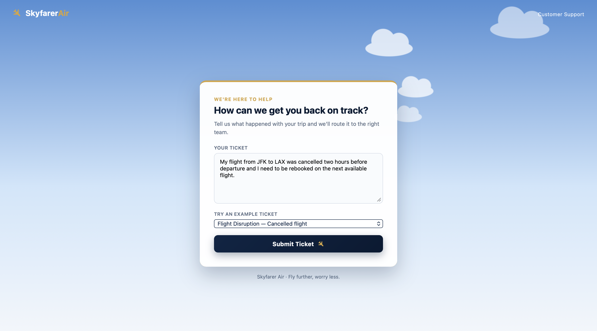
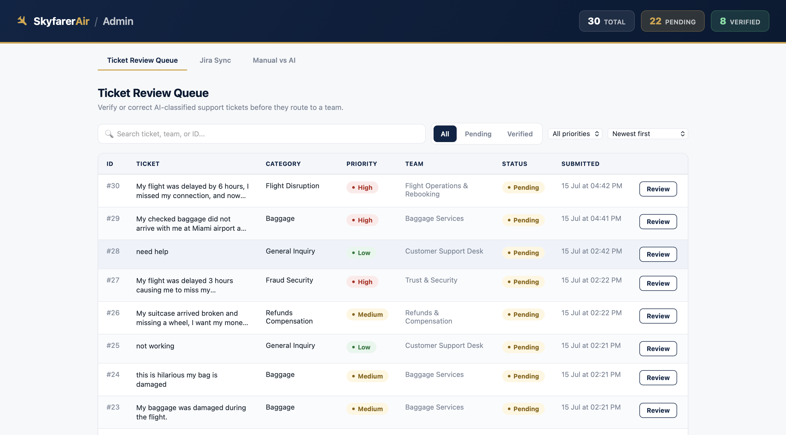
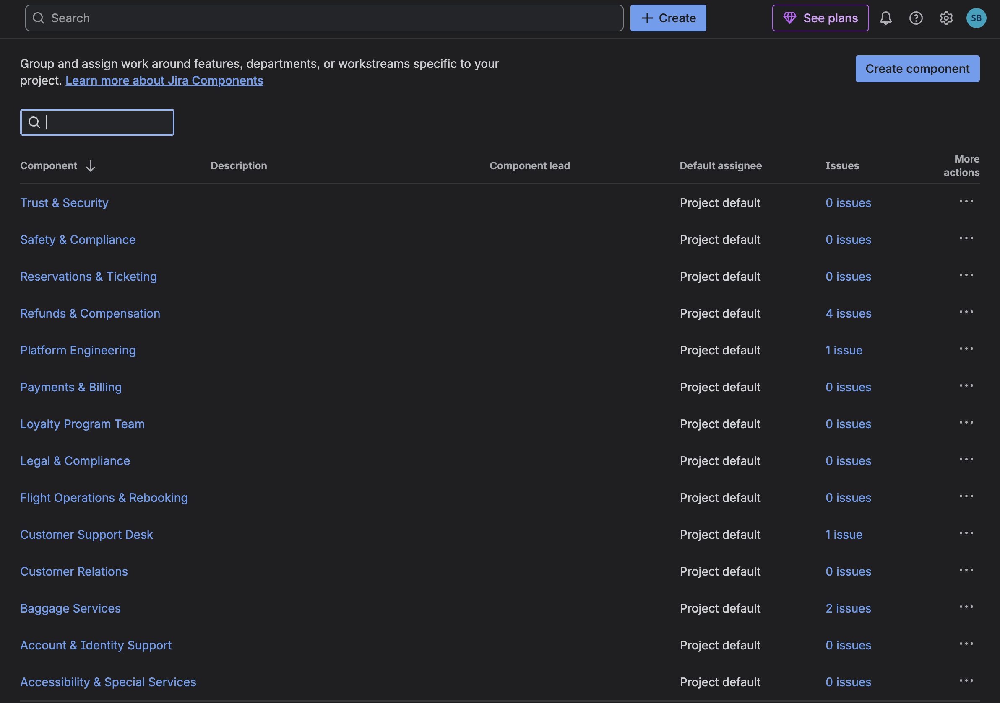
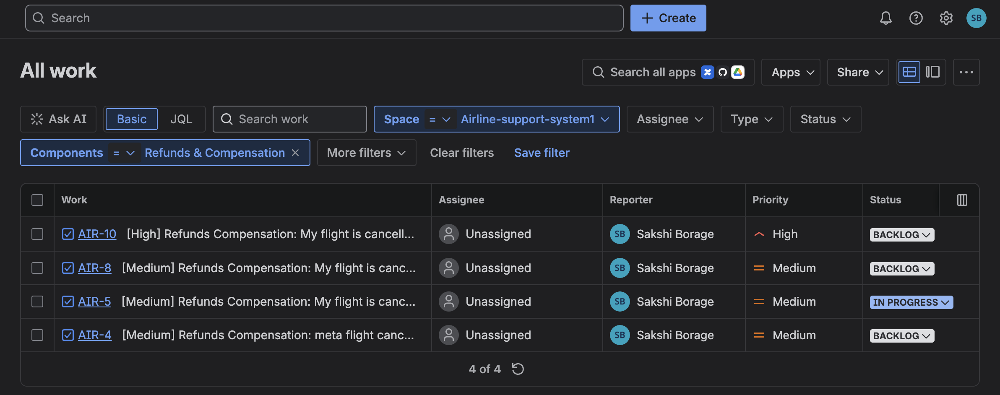
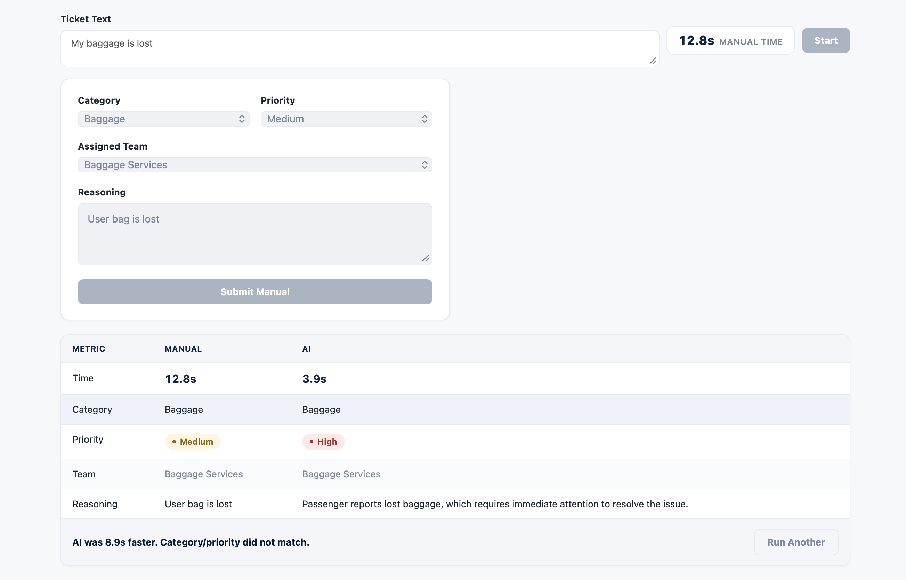

## Skyfarer Air — AI-Powered Support Ticket Routing System

## 1. Overview

This project automates customer support ticket routing for an airline (Skyfarer Air) using a Large Language Model (LLM).

Given a raw passenger support message, the system:
- Filters out messages that have nothing to do with airline support before they're ever routed.
- Identifies the most appropriate business category.
- Assigns a priority (High / Medium / Low).
- Maps the ticket to the responsible support team.
- Provides a concise, single-sentence reasoning for the routing decision.
- Lets an admin review, correct, and verify the AI's decision.
- Automatically creates a Jira ticket once a routing decision is verified, with retry support if that sync fails.

The objective is to reduce manual triaging effort while keeping routing decisions consistent, structured, and auditable.

---

## 2. Category → Team Mapping

Every ticket is classified into exactly one of the following categories, each mapped to a single predefined support team:

| Category | Assigned Team |
|---|---|
| `flight_disruption` | Flight Operations & Rebooking |
| `baggage` | Baggage Services |
| `reservations_ticketing` | Reservations & Ticketing |
| `refunds_compensation` | Refunds & Compensation |
| `payments_billing` | Payments & Billing |
| `loyalty_program` | Loyalty Program Team |
| `account_access` | Account & Identity Support |
| `special_assistance` | Accessibility & Special Services |
| `discrimination_complaint` | Legal & Compliance |
| `fraud_security` | Trust & Security |
| `safety_incident` | Safety & Compliance |
| `technical_platform` | Platform Engineering |
| `feedback_complaints` | Customer Relations |
| `general_inquiry` | Customer Support Desk |

**Critical categories** — `safety_incident`, `fraud_security`, and `discrimination_complaint` — always take priority over every other category if present in a ticket, regardless of what else is mentioned.

Priority is always exactly one of **High**, **Medium**, or **Low**.

---

## 3. Workflows

### Classification pipeline
```
Passenger Ticket
       │
       ▼
Input Validation (blank / too long / unreadable)
       │
       ▼
Preprocessing (summarize if long)
       │
       ▼
Relevance Gate ── not relevant ──► Rejected (HTTP 400 to passenger)
       │
     relevant
       │
       ▼
Prompt Construction
       │
       ▼
LLM Classification
       │
       ▼
JSON Schema Validation
       │
       ▼
Retry (if validation fails)
       │
       ▼
Fallback Response (if retry also fails)
       │
       ▼
Final Routing Decision → saved to DB → visible in Admin Review Queue
```

### Admin verify → Jira sync
```
Admin opens ticket in Review Queue
       │
       ▼
Corrects category / priority / team / reasoning
       │
       ▼
Click Verify
       │
       ▼
Ticket saved as verified (jira_status = "pending")
       │
       ▼
Background Task → Create Jira Ticket
       │
       ├── Success → jira_status = "created", jira_ticket_key stored
       │
       └── Failure → jira_status = "failed"
                          │
                          ▼
                 Admin retries from Jira Sync tab
```


## 5. Output Format

The core classification endpoint returns:

```json
{
  "category": "refunds_compensation",
  "priority": "High",
  "assigned_team": "Refunds & Compensation",
  "reasoning": "Passenger's primary request is refunding the duplicate payment, which caused financial loss."
}
```

---

## 6. Technology Stack

- **Backend**: Python, FastAPI, SQLAlchemy (SQLite), Pydantic
- **LLM orchestration**: LangChain (`langchain-openai`, `langchain-groq`, and other provider integrations as needed)
- **Frontend**: Plain HTML/CSS/JavaScript 
- **Integrations**: Jira Cloud REST API (`requests`)
- **Config**: `python-dotenv`

---


## 8. Setup & How to Run

### Prerequisites
- Python 3.10+
- API keys for at least one supported LLM provider (OpenAI and/or Groq)
- A Jira Cloud site + API token (only required for the Jira sync feature)

### 1. Install dependencies
```bash
pip install -r requirements.txt
```

### 2. Configure environment variables
Create a `.env` file in the project root:
```bash
# LLM provider config
LLM_PROVIDER=openai
OPENAI_API_KEY=your_openai_key
OPENAI_MODEL=gpt-4o-mini

FALLBACK_LLM_PROVIDER=groq
GROQ_API_KEY=your_groq_key
GROQ_MODEL=llama-3.3-70b-versatile

SUMMARY_MODEL=gpt-4o-mini

# Jira integration (optional — required only for Jira sync)
JIRA_URL=https://your-domain.atlassian.net
JIRA_EMAIL=your_email@example.com
JIRA_API_TOKEN=your_jira_api_token
JIRA_PROJECT_KEY=YOUR_PROJECT_KEY
```

### 3. Run the backend
```bash
cd backend
python -m uvicorn app.main:app --reload --port 8000
```
The API is now available at `http://127.0.0.1:8000`
 The SQLite database and its schema are created/migrated automatically on startup.

### 4. Run the frontend
No build step required — open directly in a browser, or serve statically:
```bash
cd frontend
python -m http.server 5500
```
- Passenger ticket form: `http://127.0.0.1:5500/index.html`
- Admin dashboard: `http://127.0.0.1:5500/admin.html`

> The frontend's `API_BASE_URL` in `script.js` / `admin.js` defaults to `http://127.0.0.1:8000` — update it if the backend runs elsewhere.

---

## 9. Screenshots

**Passenger ticket submission form** — the "Try an example ticket" dropdown loads one of 20 sample tickets into the textarea.


**Admin Ticket Review Queue** — every classified ticket with its AI-assigned category, priority, team, and verification status.


**Jira project components** — one component per support team, matching the Category → Team mapping in Section 2, used as the routing target when a Jira ticket is created.


**Jira tickets created via the sync** — issues auto-created from verified tickets, filtered here by the "Refunds & Compensation" component.


**Manual vs AI benchmark** — side-by-side comparison after both a manual and an AI classification of the same ticket, showing the time difference and whether they agree.


---

